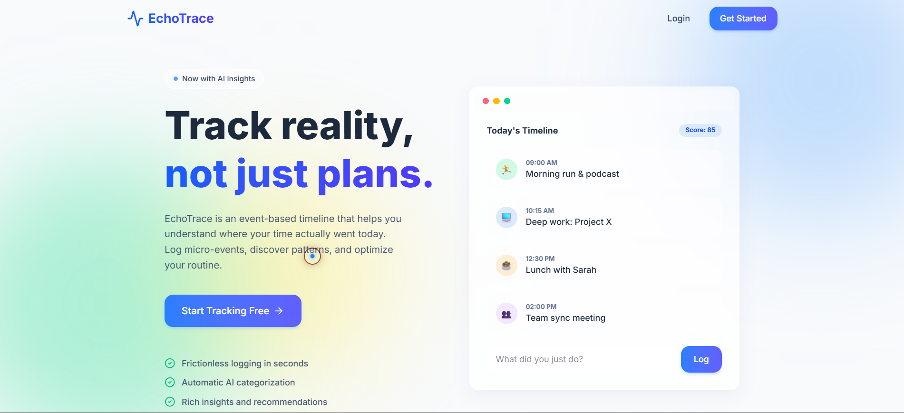
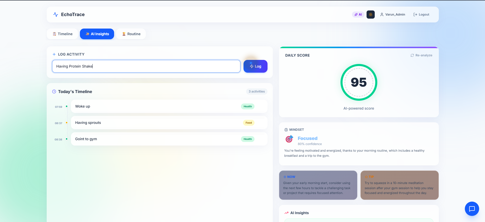
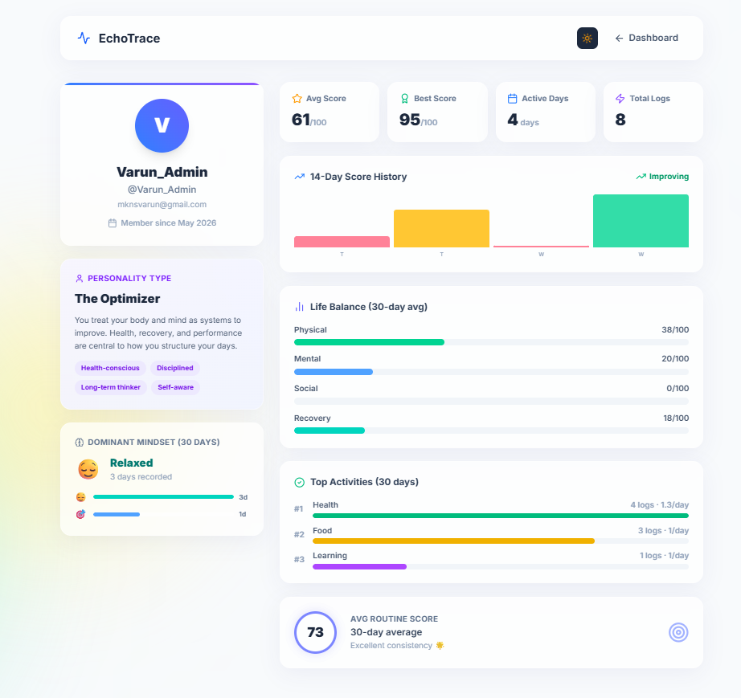

# EchoTrace

> **AI-powered event timeline and routine intelligence platform**
>
> Log micro-events throughout your day, reconstruct your real timeline, and get AI-powered productivity insights — powered by [Groq](https://groq.com).

<div align="center">
  <a href="https://echo-trace-gamma.vercel.app/">
    
  </a>
  &nbsp;
  <a href="https://echotrace-4iac.onrender.com">
    
  </a>
  &nbsp;
  <a href="https://github.com/MKN-Sai-Varun/EchoTrace/issues">
    
  </a>
</div>

---


---

## Introduction

EchoTrace helps you understand **how your day actually unfolded** — not just what you planned.

Modern productivity tools focus on tasks and habits. EchoTrace focuses on **reality**: you log short, timestamped micro-events; the system builds a daily timeline, scores your routine, infers mindset patterns, and surfaces personalized recommendations.

Context switches, productivity gaps, energy dips — EchoTrace captures all of it.

---

## Screenshots

### Landing Page


### DashBoard & Timeline


### AI Analysis


### Profile Page


---

## Features

### 🗂 Core Timeline
- Frictionless event logging with automatic timestamps
- Chronological daily timeline reconstruction
- Per-event delete with user-scoped access
- Optional categories with keyword + AI-assisted classification
- Responsive event visualization across all devices

### 🤖 AI Routine Intelligence (Groq)
- Productivity scoring and behavioral analysis
- Daily category breakdowns and activity summaries
- Mindset inference with personalized recommendations
- Routine strengths and weakness detection
- Floating **AI Coach** chat assistant on the dashboard
- Keyword-based fallback when `GROQ_API_KEY` is not configured

### 👤 Account & User Experience
- Register/sign in with username (email optional)
- Secure HttpOnly cookie-based sessions
- Sliding auth panels on desktop; tab switcher on mobile
- Auth forms stay **light-themed** for readability in dark mode
- Light / dark theme toggle
- Animated custom cursor on desktop (disabled on touch devices)
- Responsive UI for mobile, tablet, and desktop
- Glassmorphism UI with smooth Framer Motion animations

### ⚙️ Engineering Highlights
- Layered backend architecture: routes → services → models
- AI response caching to reduce inference cost and latency
- Production-ready frontend/backend deployment separation
- Modular AI analysis service integration with Groq
- Optimized API structure for extensibility and observability

---

## Architecture

```
┌─────────────────────────────────────┐
│     Next.js Client (Vercel)         │
│  /  /auth  /dashboard  /profile     │
└──────────────┬──────────────────────┘
               │
               │ HTTPS + HttpOnly Cookies
               ▼
┌─────────────────────────────────────┐
│     Express API (Render)            │
│ /api/auth /api/events /api/analysis │
└──────────────┬──────────────────────┘
               │
       ┌───────┴────────┐
       ▼                ▼
 MongoDB Atlas      Groq API
   (Mongoose)   (llama-3.1-8b-instant)
```

---

## Tech Stack

| Layer | Technology |
|---|---|
| Frontend | Next.js 16, React 19, TypeScript, Tailwind CSS 4 |
| Backend | Node.js, Express |
| Database | MongoDB Atlas + Mongoose |
| AI | Groq OpenAI-compatible chat completions |
| Authentication | bcrypt + HttpOnly session cookies |
| Security | Helmet, CORS, express-rate-limit, express-validator |
| Animation | Framer Motion |
| Deployment | Vercel (frontend) + Render (API) |

---

## Project Structure

```
EchoTrace/
├── client/                 # Next.js frontend (deploy to Vercel)
│   └── src/
│       ├── app/            # Pages: /, /auth, /dashboard, /profile
│       └── components/     # Shared UI and feature components
│
├── src/                    # Express backend API (deploy to Render)
│   ├── models/             # MongoDB schemas: User, Session, Event, Analysis
│   ├── routes/             # auth, events, analysis
│   ├── services/           # AI, events, analysis, caching
│   └── middleware/         # Authentication and validation
│
├── public/                 # Legacy static HTML/JS prototype (Phase-0)
└── package.json            # Backend dependencies
```

---

## Getting Started

### Prerequisites
- Node.js 18+
- MongoDB Atlas connection string
- Groq API key *(optional — enables AI features)*

### 1. Backend Setup (API)

From the repository root:

```bash
npm install
```

Create a `.env` file in the root:

```env
PORT=3000
MONGO_URI=mongodb+srv://YOUR_MONGO_URI
GROQ_API_KEY=gsk_your_key_here
GROQ_MODEL=llama-3.1-8b-instant
FRONTEND_URL=http://localhost:3001
```

```bash
npm run dev
```

API runs at `http://localhost:3000`

---

### 2. Frontend Setup (Client)

```bash
cd client
npm install
```

Create `client/.env.local`:

```env
NEXT_PUBLIC_API_URL=http://localhost:3000
```

```bash
npm run dev
```

App runs at `http://localhost:3001`

---

## Environment Variables

| Variable | Description |
|---|---|
| `MONGO_URI` | MongoDB Atlas connection string |
| `GROQ_API_KEY` | Groq API key for AI analysis |
| `GROQ_MODEL` | Groq model identifier |
| `FRONTEND_URL` | Frontend origin for CORS |
| `NEXT_PUBLIC_API_URL` | Backend API URL for the frontend |
| `PORT` | Backend server port |

---

## Deployment

| Service | Host | Root Directory |
|---|---|---|
| Frontend | [Vercel](https://vercel.com) | `client/` |
| Backend | [Render](https://render.com) | Repository root |

**Vercel:** Set `NEXT_PUBLIC_API_URL` to your Render API URL.

**Render:** Set `MONGO_URI`, `PORT`, `GROQ_API_KEY`, `FRONTEND_URL`, and `NODE_ENV=production`.

> `NODE_ENV=production` ensures session cookies use `SameSite=None; Secure` for cross-origin authentication between Vercel and Render.

---

## API Overview

| Method | Endpoint | Description |
|---|---|---|
| `POST` | `/api/auth/register` | Create account |
| `POST` | `/api/auth/login` | Login using username or email |
| `POST` | `/api/auth/logout` | Logout current session |
| `GET` | `/api/auth/me` | Get authenticated user |
| `POST` | `/api/events` | Log a new event |
| `GET` | `/api/events/today` | Retrieve today's events |
| `DELETE` | `/api/events/:id` | Delete a user-owned event |
| `GET` | `/api/analysis/full-analysis` | Retrieve AI analysis |
| `POST` | `/api/analysis/full-analysis/refresh` | Regenerate analysis |
| `GET` | `/api/analysis/profile-stats` | Retrieve profile statistics |

All protected routes require the `sessionId` HttpOnly cookie from login/register.

### Example: Create Event

**Request**
```http
POST /api/events
Content-Type: application/json

{
  "label": "Worked on EchoTrace backend",
  "category": "Work"
}
```

**Response**
```json
{
  "success": true,
  "event": {
    "_id": "682c123456",
    "label": "Worked on EchoTrace backend",
    "category": "Work",
    "timestamp": "2026-05-20T08:45:12.000Z"
  }
}
```

---

## Security

- Passwords hashed with **bcrypt**
- **Helmet** HTTP headers
- **Rate limiting** — global + stricter limits on auth routes
- Input validation via **express-validator**
- Events and analysis scoped by authenticated `userId`
- CORS restricted to trusted origins only
- Secure **HttpOnly cookie**-based authentication

---

## Challenges Solved

**Cross-Origin Authentication**
Implemented secure session handling across Vercel and Render deployments using `SameSite=None`, HTTPS-only cookies, and CORS credential management.

**AI Cost Optimization**
Introduced in-memory caching and fallback logic to reduce unnecessary Groq API calls and avoid excessive inference costs.

**Responsive User Experience**
Built adaptive authentication layouts and disabled cursor effects on touch devices for smooth mobile usability.

**Why Groq?**
Selected for its ultra-low-latency inference, enabling near real-time behavioral analysis and AI coaching inside the dashboard.

---

## Functional Requirements

| ID | Requirement |
|---|---|
| FR-1 | Log timestamped micro-events with label and optional category |
| FR-2 | Immutable event timestamps after creation |
| FR-3 | Chronological daily timeline reconstruction |
| FR-4 | Optional context-switch / gap detection |
| FR-5 | AI-assisted event categorization with keyword fallback |
| FR-6 | Date-based event retrieval |
| FR-7 | Consistent event ordering by timestamp |

## Non-Functional Requirements

| ID | Requirement |
|---|---|
| NFR-1 | Low-friction logging (a few seconds per event) |
| NFR-2 | Reliable persistence with MongoDB |
| NFR-3 | Immutable event storage |
| NFR-4 | Refreshable and regeneratable AI analysis |
| NFR-5 | Fast timeline retrieval for "today" views |
| NFR-6 | Modular backend: separated routes, services, and models |
| NFR-7 | Extensible for caching, queues, and observability |
| NFR-8 | Privacy-first: only user-submitted events, no passive tracking |

---

## Future Enhancements

- 🧠 Semantic memory using vector embeddings
- 📊 Weekly behavioral reports and summaries
- 🔥 Context-switch heatmaps and visualization
- 🔄 WebSocket-based live timeline synchronization
- 📱 Native mobile companion app
- 🔐 OAuth integration (Google / GitHub)
- ⏱ Background job queues for scheduled nightly analysis

---

## What I Learned

Building EchoTrace strengthened my understanding of:
- Secure cross-origin authentication across separate deployment hosts
- Scalable frontend/backend separation with real production constraints
- AI inference optimization and cost-aware caching strategies
- REST API architecture design and session management
- Responsive UI engineering and adaptive layout techniques
- Production deployment workflows across Vercel and Render

---

## Philosophy

> *Understanding behavior starts with observing reality, not enforcing plans.*

EchoTrace prioritizes **clarity, correctness, and extensibility** — a working full-stack product with AI augmentation, without over-engineering the first release.

---

## Author

<table>
  <tr>
    <td align="center">
      <strong>MKN Sai Varun</strong><br/>
      Building intelligent full-stack systems that combine AI, usability, and real-world impact.<br/><br/>
      <a href="https://www.linkedin.com/in/mknsvarun">LinkedIn</a> •
      <a href="https://github.com/MKN-Sai-Varun">GitHub</a>
    </td>
  </tr>
</table>

---
 
## 🌐 View More of My Work
 
<div align="center">
Like what you see? Check out my other projects and work on my portfolio.
 
  <a href="https://portfolio-tau-ochre-61.vercel.app/">
    
  </a>
  
---
 
## License
 
This project is licensed under the **MIT License** — see the [LICENSE](./LICENSE) file for details.
